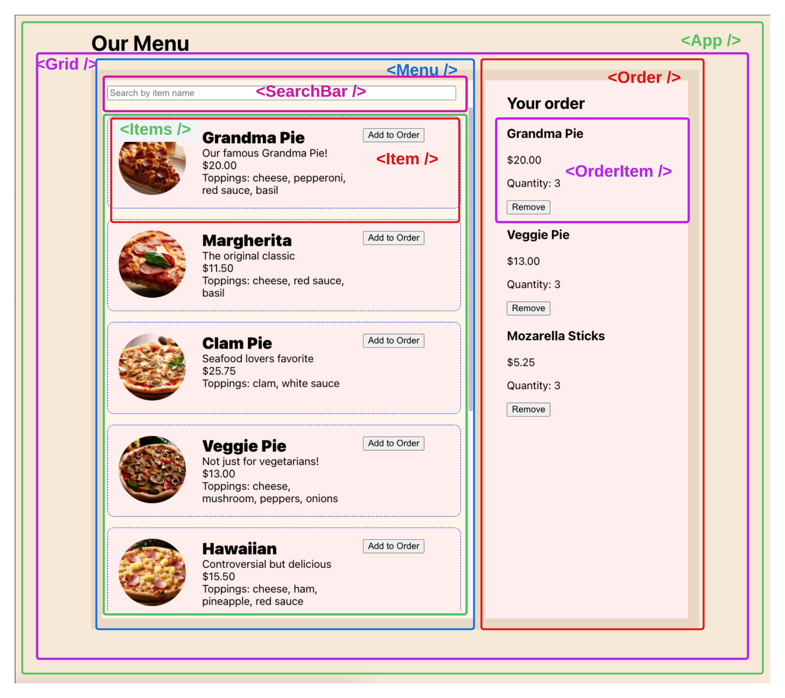

# Lifting state up: Fix the bugs

## TEAM MEMBERS
List your team members here
```
1.
2.
3.
...
```

## GETTING STARTED AND SUBMITTING
1. Fork and clone this repo
1. run `npm install` to install, then `npm start` to start.
1. When you have finished **all** of steps 1-4, submit by making a PR on the original repo.
1. If you do not finish all the steps before time runs out, submit what you have as a PR.

## USER STORIES
You can refer to the [deployed and fixed version of this site](https://lift-state-bugfix.netlify.app/) to see how each of these user stories behaves when they are working correctly.
1. When I vist the home page, I see a list of menu items and my current order.
1. Each menu item has a name, short description, formatted price, and list of toppings (if the item has toppings)
1. When I type in the search bar, the list of items is filtered and I only see items whose name contains the text in the search bar.
1. When I click "Add to Order" the item is added to the order with quantity 1. If it is already in the order, its quantity increments. When I click "Remove", the quantity decreases. When the quantity reaches 0, the item disappears from the order.

## STEP 1: FIND THE BUGS
1. For each of the user stories, check whether it works.
1. If a user story is broken, document the bug. Write the steps to reproduce it and the actual vs. expected results.
1. Add your bug descriptions here in the README.md. There may be more than 2 bugs (or fewer!).

### BUG 1
```
// type your answer here
Steps to reproduce:
1.
2.
...
**Expected result**:
**Actual result**:
```

### BUG 2
```
// type your answer here
Steps to reproduce:
1.
2.
...
**Expected result**:
**Actual result**:
```

## STEP 2: PLAN 
How will you fix each bug? In your group, make a plan. Write down the key steps.

**Hint 1**: You will need to lift state up to fix these bugs! Think about how you will lift state up. What states will you move? What common parents will own them?

**Hint 2**: Look at the diagrams at the bottom of this file. Which pieces of state are in the wrong place in the component tree?

### BUG 1
```
Key steps to fix the bug
1.
2.
...
```

### BUG 2
```
Key steps to fix the bug
1.
2.
...
```
## STEP 3: FIX THE BUGS
Fix the bugs! Implement the plans you wrote above.
If you realize the plan needs to change, update it.
Make a separate commit for each bug fix or group of related fixes.

## More information
Here is an image of the UI divided into components.


This diagram shows the component tree and the state held by each component (if any). This shows the design of the code, which you are going to fix. Some of this state is in the wrong place!


